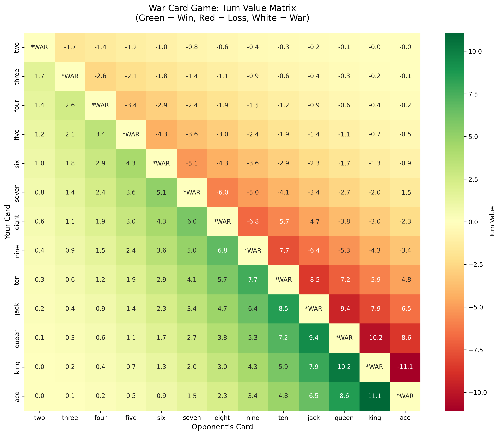
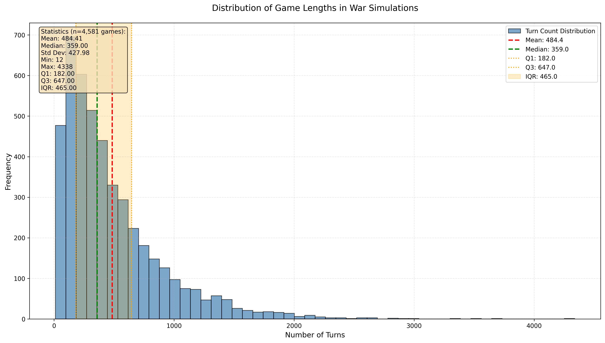

# War Probs: Assorted Analytics for Card Game _War_

This repository is a collection of code snippets for simulating the card game _war_ and developing statistical metrics around the game.

While the game is incredibly simple and entirely luck based, and nearly deterministic based on the initial shuffle and deal, there are some interesting patterns that emerge when analyzing the game.

## Turn Value Metrics

In my attempt to quantify the value of a turn in the game of _war_, I developed a metric that takes into account the card values and the margin of victory or defeat. The metric is defined as follows:

```md
If you WIN:
    Turn Value = Card_won × (1 - margin/13)^k

If you LOSE:
    Turn Value = -(Card_lost × (1 + margin/13)^k)

Where:
- `margin` is the difference between the winning (or max value) card and the losing card
- `k` is a tuning parameter (maybe k=1 or k=2).
```

To generate these scores, use the following Python code:

```python
from war_probs.cards import get_card
from war_probs.metrics import turn_value

## -- create example cards
king_of_spades = get_card(rank="king", suit="spades")
jack_of_clubs = get_card(rank="jack", suit="clubs")

turn_value(your_card=king_of_spades, opp_card=jack_of_clubs)
>>>  7.875739644970414
```

With card values ranging from 2 to 14 (i.e., _ace_), we can visualize all possible turn values.




## Turn Count Distribution

I was interested in the distribution of turn counts for a game of war. Using the simulator, I ran a large number of games (~25,000) and collected the number of turns for each game before a player won. The distribution is shown below.

```python
from war_probs.game import Game

NUM_SIMULATIONS: int = 25_000
MAX_TURNS: int = 5_000

completed_games: list = []
draw_games: list = []

for _ in range(NUM_SIMULATIONS):
    ## -- initialize a game
    game = Game(max_turns=MAX_TURNS)

    ## -- simulate game
    results = game.play()

    if results["completed_turns"] < MAX_TURNS:
        completed_games.append(results)
    else:
        draw_games.append(results)
```




## Next Steps

Here are additional things I may work on next:

- collect turn value scores at each turn in a game simulation and measure game swings
- create a metric to quantify value for winning a _war_ scenario, in which multiple cards are transferred from the loser to the winner's hand
